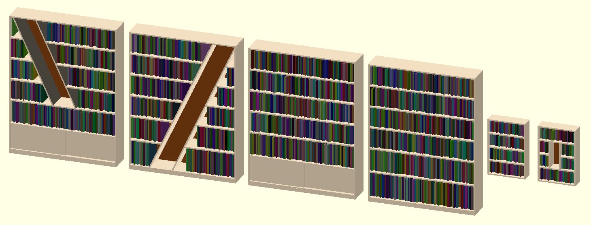
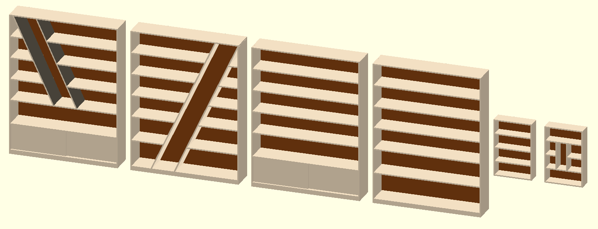
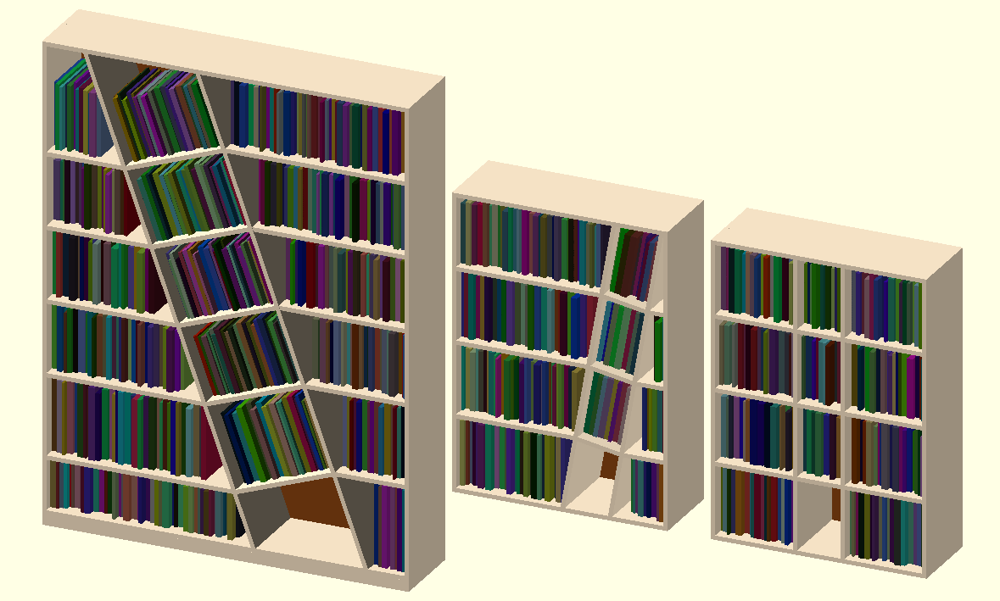
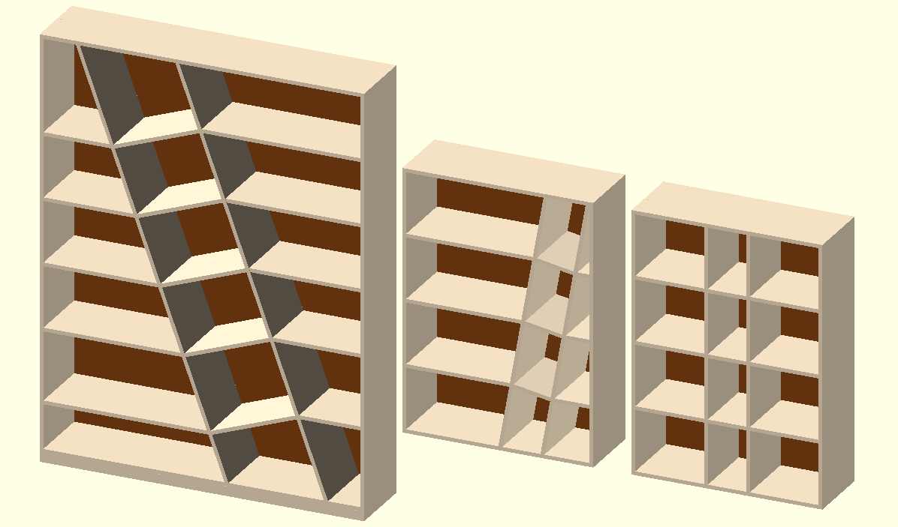

List of files
-------------

| Name                 | Description                                        |
|----------------------|----------------------------------------------------|
| tools                | Set of common definitions and tools                |
| wood                 | Define a wood board (improve 'cube')               |
| sample_wood          | Sample for wood colors                             |
| sample_book          | Generate random books, for better visualisation    |
| cabinet              | Define the outer 'shell' of a cabinet              |
| bookshelf_straight   | Bookshelf, straight shelves, optional doors, niche |
| bookshelf_diagonal   | Bookshelf, with tilted diagonal (with shelves)     |

**If you open a file in openscad, it displays some examples, showcasing the capabilities of the file.**


Functionnalities
----------------

The 'sample_book' file allows to draw book on the shelves. Thanks to its definition it should appear in the openscad customiser (from version 2019.05 and later).

If you want to customise/create your own file and want to have the same option, you should define the following variable at the top of your main file (before any module line):
```openscad
	include <sample_book.scad>
	//... other include/use ...
	
	//In order to draw books and visualise them, inside sample_books.scad, change the variable value
	//Dispaly book to help at visualisation
	ADD_BOOKS=false;
	
	//... rest of the code ...
```

Furnitures
==========

Bookshelf - Straight
--------------------

The 'bookshelf_straight' file allows to build a bookshelf with straight shelves. It offers optionnal doors on the lowest level, and the addition of a 'niche'.
The figure bellow demonstrates a varietty of use cases:




_The bookshlef sample here is demonstrated with empty and full shelves, see the 'Functionnalities' above for more details._

A bookshelf has the following defition and parameters:
`bookshelf_straight(shelves_height, bookshelf_width, bookshelf_depth, foot_height, side_thickness, back_thickness, shelf_thickness, niche, niche_width, niche_angle, niche_position, add_doors, door_covering, door_recess)`

* shelves_height: List of shelves height, from bottom to top, (e.g. shelves_height=[30, 20, 10] defines a bookshelf with 3 shelves, of decreasing height a we go up)
* bookshelf_width, bookshelf_depth: Define the bookshelf dimensions (the height is computed from the shelves height and foot height)
* foot_height: Defines the height of the foot: along the length of the cabinet, under the bottom shelf a bar help stabilise and strengthen the cabinet
* side_thickness, back_thickness, shelf_thickness: Define the wood thickness for the sides, back and shelves
* niche - defines the first and last level for a niche, no niche if empty, 0 means bottom of bookshelf, and can be equal to the number of shelves for the niche to touch the top (e.g. [1, 3] means from the first to the third shelves (reaching the bottom of the fourth shelf))
  * niche_width - defines the horizontal distance inside the niche
  * niche_angle - angle for the niche, positive to bend it to the left, negative for the right
  * niche_position - between 0 and 1 will be interprated as percentage (e.g. 0.3 = 30%), any value above one will be interprated as a dimension
* add_doors (def: false) - Trigger the option for sliding doors on bottom level
  * door_covering - Define the length that the door share: the front door, when closed will cover the back one from this distance
  * door_recess - Define how much the front door is recessed inside the bookshelf, the back door is considered touching the front one (no gap is considered here)


Bookshelf - Diagonal
--------------------

The 'bookshelf_diagonal' file allows to build a bookshelf with a diagonal inside (with shelves).
The figure bellow demonstrates a varietty of use cases:




A bookshelf has the following defition and parameters:
`bookshelf_diagonal(shelves_height, bookshelf_width, bookshelf_depth, foot_height, side_thickness, back_thickness, shelf_thickness, diagonal_width, diagonal_angle, diagonal_position)`

* shelves_height: List of shelves height, from bottom to top, (e.g. shelves_height=[30, 20, 10] defines a bookshelf with 3 shelves, of decreasing height a we go up)
* bookshelf_width, bookshelf_depth: Define the bookshelf dimensions (the height is computed from the shelves height and foot height)
* foot_height: Defines the height of the foot: along the length of the cabinet, under the bottom shelf a bar help stabilise and strengthen the cabinet
* side_thickness, back_thickness, shelf_thickness: Define the wood thickness for the sides, back and shelves
* diagonal_width: Defines the horizontal distance inside the diagonal
* diagonal_angle: Angle for the diagonal, positive to tilt it to the left, negative for the right
* diagonal_position: Between 0 and 1 will be interprated as percentage (e.g. 0.3 = 30%), any value above one will be interprated as a dimension (from left side)
