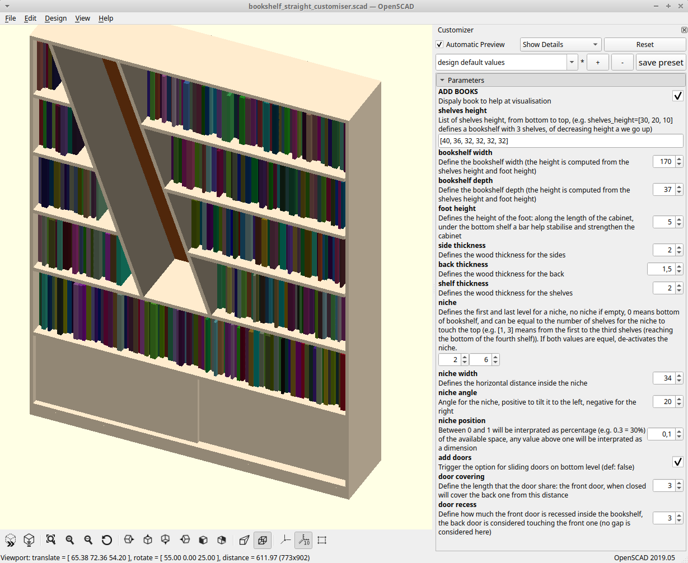
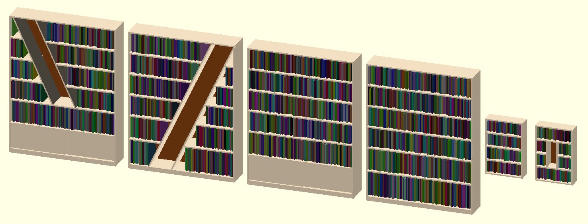
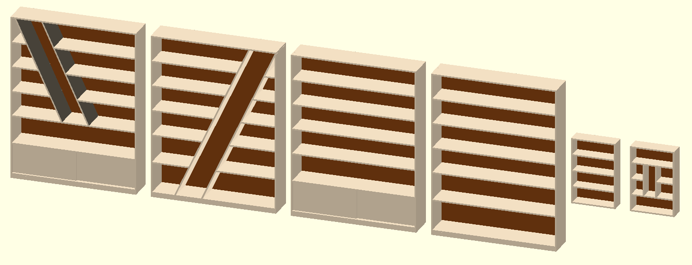
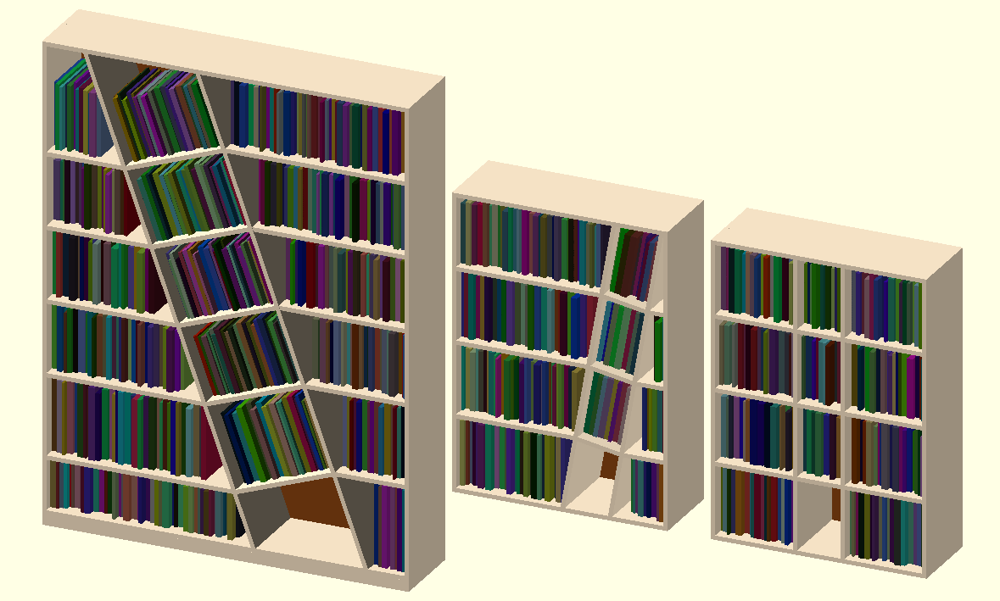
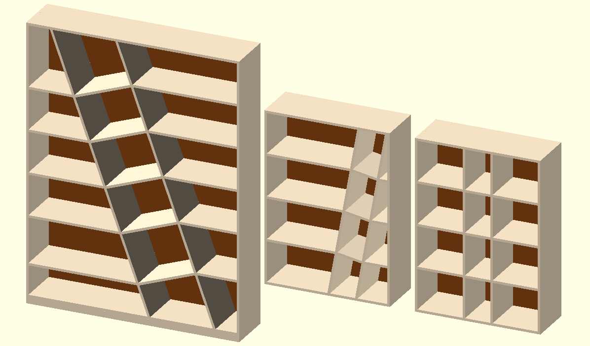
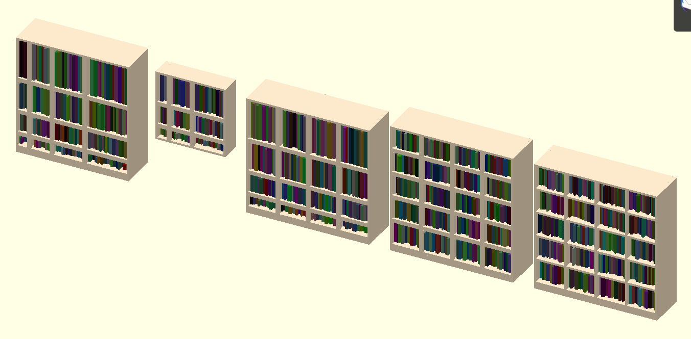
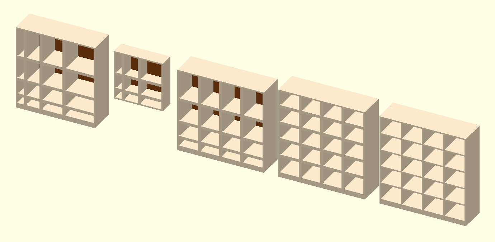
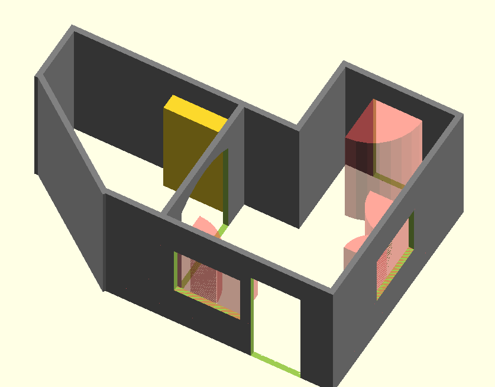

Description
-----------

This project provides a set of tools to design and customise pieces of furnitures. It uses OpenScad, a scripting CAD modeler.

The first section lists the files and their role.
The second section presents the general functionnalitities available.
The following section presents each individual piece of furniture and its controls.
The final section presents the wall utility, that allows to build room and place furniture inside.

List of files
-------------

| Name                 | Description                                        |
|----------------------|----------------------------------------------------|
| tools                | Set of common definitions and tools                |
| wood                 | Define a wood board (improve 'cube')               |
| sample_wood          | Sample for wood colors                             |
| sample_book          | Generate random books, for better visualisation    |
| cabinet              | Define the outer 'shell' of a cabinet              |
| bookshelf_straight   | Bookshelf, straight shelves, optional doors, niche |
| bookshelf_diagonal   | Bookshelf, with tilted diagonal (with shelves)     |
| bookshelf_cells      | Bookshelf, with inner walls (several options)      |
| room                 | Utility to draw room and palce furniture inside    |

**If you open a file in openscad, it displays some examples, showcasing the capabilities of the file.**

The 'sample' directory holds sample codes, and customiser. Each demo code has a corresponding image to ahve an idea of the result.

Functionnalities
----------------

### Furniture customiser

In the 'sample' directory, there is a "customiser" version of each piece of furniture, its goal is to allow easier design: it uses OpenScad customiser to allow you to modify and customise your furniture with requiring code modification.



### Sample books and wood

The 'sample_book' file allows to draw book on the shelves. Thanks to its definition it should appear in the openscad customiser (from version 2019.05 and later).

If you want to customise/create your own file and want to have the same option, you should define the following variable at the top of your main file (before any module line):
```openscad
	include <sample_book.scad>
	//... other include/use ...
	
	//In order to draw books and visualise them, inside sample_books.scad, change the variable value
	//Dispaly book to help at visualisation
	ADD_BOOKS=false;
	
	//... rest of the code ...
```

Furniture
=========

Bookshelf - Straight
--------------------

The 'bookshelf_straight' file allows to build a bookshelf with straight shelves. It offers optionnal doors on the lowest level, and the addition of a 'niche'.
The figure bellow demonstrates a varietty of use cases:




_The bookshlef sample here is demonstrated with empty and full shelves, see the 'Functionnalities' above for more details._

A bookshelf has the following defition and parameters:
`bookshelf_straight(shelves_height, bookshelf_width, bookshelf_depth, foot_height, side_thickness, back_thickness, shelf_thickness, niche, niche_width, niche_angle, niche_position, add_doors, door_covering, door_recess)`

* shelves_height: List of shelves height, from bottom to top, (e.g. shelves_height=[30, 20, 10] defines a bookshelf with 3 shelves, of decreasing height a we go up)
* bookshelf_width, bookshelf_depth: Define the bookshelf dimensions (the height is computed from the shelves height and foot height)
* foot_height: Defines the height of the foot: along the length of the cabinet, under the bottom shelf a bar help stabilise and strengthen the cabinet
* side_thickness, back_thickness, shelf_thickness: Define the wood thickness for the sides, back and shelves
* niche - defines the first and last level for a niche, no niche if empty, 0 means bottom of bookshelf, and can be equal to the number of shelves for the niche to touch the top (e.g. [1, 3] means from the first to the third shelves (reaching the bottom of the fourth shelf))
  * niche_width - defines the horizontal distance inside the niche
  * niche_angle - angle for the niche, positive to bend it to the left, negative for the right
  * niche_position - between 0 and 1 will be interprated as percentage (e.g. 0.3 = 30%) of the available space, any value above one will be interprated as a dimension
* add_doors (def: false) - Trigger the option for sliding doors on bottom level
  * door_covering - Define the length that the door share: the front door, when closed will cover the back one from this distance
  * door_recess - Define how much the front door is recessed inside the bookshelf, the back door is considered touching the front one (no gap is considered here)


Bookshelf - Diagonal
--------------------

The 'bookshelf_diagonal' file allows to build a bookshelf with a diagonal inside (with shelves).
The figure bellow demonstrates a varietty of use cases:




A bookshelf has the following defition and parameters:
`bookshelf_diagonal(shelves_height, bookshelf_width, bookshelf_depth, foot_height, side_thickness, back_thickness, shelf_thickness, diagonal_width, diagonal_angle, diagonal_position)`

* shelves_height: List of shelves height, from bottom to top, (e.g. shelves_height=[30, 20, 10] defines a bookshelf with 3 shelves, of decreasing height a we go up)
* bookshelf_width, bookshelf_depth: Define the bookshelf dimensions (the height is computed from the shelves height and foot height)
* foot_height: Defines the height of the foot: along the length of the cabinet, under the bottom shelf a bar help stabilise and strengthen the cabinet
* side_thickness, back_thickness, shelf_thickness: Define the wood thickness for the sides, back and shelves
* diagonal_width: Defines the horizontal distance inside the diagonal
* diagonal_angle: Angle for the diagonal, positive to tilt it to the left, negative for the right
* diagonal_position: Between 0 and 1 will be interprated as percentage (e.g. 0.3 = 30%) of the available space, any value above one will be interprated as a dimension (from left side)


Bookshelf - Cells/Rack
----------------------

The 'bookshelf_celss' file allows to build a bookshelf with a inner walls and optional border. It has three functions depending on the level of control you want.
The figure bellow demonstrates a varietty of use cases:




Defines a bookshelf with straight shelves and inner walls with the following defition and parameters:
`bookshelf_cells(shelves_height, shelves_width, bookshelf_depth, foot_height, side_thickness, back_thickness, shelf_thickness, border_height)`

* shelves_height: List of shelves height, from bottom to top, (e.g. shelves_height=[30, 20, 10] defines a bookshelf with 3 shelves, of decreasing height a we go up)
* shelves_width: List of shelves width, defines the bookshelf_width
* bookshelf_depth: Define the bookshelf dimensions (the height is computed from the shelves height and foot height, the width is computed from the shelves width)
* foot_height: Defines the height of the foot: along the length of the cabinet, under the bottom shelf a bar help stabilise and strengthen the cabinet
* side_thickness, back_thickness, shelf_thickness: Define the wood thickness for the sides, back and shelves
* border_height: (Optional) Place a border in front of each cell (vertically and horizontally), 0 will remove the border. Borders are centered vertically, bottom aligned horizonyally.

Defines a bookshelf with straight shelves and inner walls (cells all have equal width) with the following defition and parameters:
`bookshelf_even_width_cells(shelves_height, number_inner_walls, bookshelf_width, bookshelf_depth, foot_height, side_thickness, back_thickness, shelf_thickness, border_height)`

* shelves_height - List of shelves height, from bottom to top, (e.g. shelves_height=[30, 20, 10] defines a bookshelf with 3 shelves, of decreasing height a we go up)
*  number_inner_walls - Number of inner-wall to place
* bookshelf_width, bookshelf_depth: Define the bookshelf dimensions (the height is computed from the shelves height and foot height)
* foot_height - Defines the height of the foot: along the length of the cabinet, under the bottom shelf a bar help stabilise and strengthen the cabinet
* side_thickness, back_thickness, shelf_thickness: Define the wood thickness for the sides, back and shelves
* border_height - (Optional) Place a border in front of each cell (vertically and horizontally), 0 will remove the border. Borders are centered vertically, bottom aligned horizonyally.

Defines a bookshelf with straight shelves and inner walls (cells all have equal width and height) with the following defition and parameters:
`bookshelf_even_cells(number_shelves, number_inner_walls, bookshelf_width, bookshelf_height, bookshelf_depth, foot_height, side_thickness, back_thickness, shelf_thickness, border_height)`

* number_shelves - Number of shelves (lowest level included)
* number_inner_walls - Number of inner-wall to place
* bookshelf_width, bookshelf_depth, bookshelf_depth: Define the bookshelf dimensions
* foot_height - Defines the height of the foot: along the length of the cabinet, under the bottom shelf a bar help stabilise and strengthen the cabinet
* side_thickness, back_thickness, shelf_thickness: Define the wood thickness for the sides, back and shelves
* border_height - (Optional) Place a border in front of each cell (vertically and horizontally), 0 will remove the border. Borders are centered vertically, bottom aligned horizonyally.


Room utility
============

The room utility is composed of the following tools:
* walls - To build walls
* translate_on_wall - (and translate_on_wall_end) Allows to place furniture in a room using walls as reference
* create_fixed_opening - Allows to create an opening in a given wall
* create_panel_opening - Allows to create an opening, closed by a single panel (e.g. room door)
* create_double_panel_opening - Allows to create an opening, closed by a two panels
* create_custom_opening - Allows to create an opening with any shape

For details on each function please refer to the code. This section will only present a proposed workflow to use the room utility.



The figure shows an example of a 2-rooms flat, with a sample piece of furniture. It also displays the swept volume for the windows and doors panels.

Step 1 - Create the walls
-------------------------

Create a wall list, use the data-structures builder and the 'walls' module to place the walls.
You can start by a single wall, and add them one by one.

	walls=[[wall1_length, wall1_angle, wall1_thickness], [wall2... ], ...]
	walls_angle = Build_walls_angle(walls);
	walls_origin = Build_walls_origin(walls, walls_angle);
	walls_end = Build_walls_end(walls, walls_angle, walls_origin);

	walls(walls, walls_angle, walls_origin, default_walls_height=250);

Customise the walls until you are happy.

Step 2 - Place the opening
--------------------------
Again, one by one, add line above the 'walls' module to create the different openings

	walls=... (and walls_angle, walls_origin, walls_end)

	+ create_fixed_opening(walls, walls_angle, walls_origin, <wall_id>, [<offset on wall>, <height>], [<width>, <height>])
	+ create_fixed_opening(walls, walls_angle, walls_origin, <wall_id_bis>, [<offset on wall bis>, <height bis>], [<width bis>, <height bis>])
	walls(walls, walls_angle, walls_origin, default_walls_height=250);

N.B. Please note that the "create_..._opening()" do not have a ';' at the end of the line, since they are meant to stack with the wall.

Step 3 - Place the furniture
----------------------------
Place the furniture in the newly created room.

	walls=... (and walls_angle, walls_origin, walls_end)

	create_fixed_opening(walls, walls_angle, walls_origin, <wall_id>, [<offset on wall>, <height>], [<width>, <height>])
	create_fixed_opening(walls, walls_angle, walls_origin, <wall_id_bis>, [<offset on wall bis>, <height bis>], [<width bis>, <height bis>])
	walls(walls, walls_angle, walls_origin, default_walls_height=250);

	+ translate_on_wall(walls_angle, walls_origin, wall_id){
	+	... The furniture on wall 'wall_id', they can be moved around on the wall with translate operation (relative to the bottom left corner)
	+	translate([...]) rotate([...]) ...piece_of_furniture...
	+	translate([...]) rotate([...]) ...other_piece_of_furniture...
	+ }

	+ translate_on_wall(walls_angle, walls_origin, wall_id_bis){
	+	... Place furniture on wall_id_bis
	+ }

Step 4 - Place the room
-----------------------
Now that the room is ready, place it relative to other rooms.

	walls=... (and walls_angle, walls_origin, walls_end)

	+ translate([...]) rotate([...]) {
		create_fixed_opening(walls, walls_angle, walls_origin, <wall_id>, [<offset on wall>, <height>], [<width>, <height>])
		create_fixed_opening(walls, walls_angle, walls_origin, <wall_id_bis>, [<offset on wall bis>, <height bis>], [<width bis>, <height bis>])
		walls(walls, walls_angle, walls_origin, default_walls_height=250);

		translate_on_wall(walls_angle, walls_origin, wall_id){
			... Place furntiure on wall_id
		}

		translate_on_wall(walls_angle, walls_origin, wall_id_bis){
			... Place furniture on wall_id_bis
		}
	+ }

Now you can repeat the process for all the other rooms
